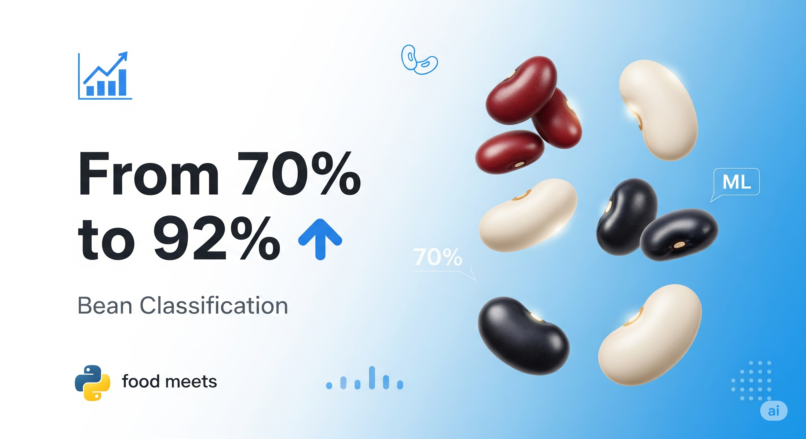

# Dry Bean Classification Project

## Overview

This project implements a multiclass classification system to predict dry bean varieties using machine learning techniques. The system classifies beans into 7 different classes: Seker, Barbunya, Bombay, Cali, Dermason, Horoz, and Sira based on their physical characteristics.

## Dataset Information

### Source
- **Citation**: KOKLU, M. and OZKAN, I.A., (2020), Multiclass Classification of Dry Beans Using Computer Vision and Machine Learning Techniques. Computers and Electronics in Agriculture, 174, 105507.
- **DOI**: https://doi.org/10.1016/j.compag.2020.105507
- **Dataset**: [Murat Koklu's Dataset Page](https://www.muratkoklu.com/datasets/)

### Features (16 attributes)
- **area**: The area of a bean zone and the number of pixels within its boundaries
- **perimeter**: Bean circumference defined as the length of its border
- **majorAxisLength**: Distance between the ends of the longest line drawable from a bean
- **minorAxisLength**: Longest line drawable perpendicular to the main axis
- **aspectRatio**: Relationship between major and minor axis lengths
- **eccentricity**: Eccentricity of the ellipse having the same moments as the region
- **convexArea**: Number of pixels in the smallest convex polygon containing the bean area
- **equivDiameter**: Diameter of a circle having the same area as the bean
- **extent**: Ratio of pixels in bounding box to bean area
- **solidity**: Ratio of pixels in convex shell to those in beans
- **roundness**: Calculated as (4 * π * Area) / (Perimeter²)
- **compactness**: EquivalentDiameter / MajorAxisLength
- **shapeFactor1**: Area / Perimeter²
- **shapeFactor2**: Area / MajorAxisLength²
- **shapeFactor3**: Area / (MajorAxisLength × MinorAxisLength)
- **shapeFactor4**: Perimeter / (MajorAxisLength × MinorAxisLength)

### Target Classes (7 varieties)
Seker, Barbunya, Bombay, Cali, Dermason, Horoz, Sira

## Installation & Setup

```bash
# Required libraries
pip install pandas numpy scikit-learn matplotlib seaborn openpyxl
```

## Data Preprocessing

- **Dataset**: 13,611 samples with 16 features
- **Missing Values**: None detected
- **Train-Test Split**: 80% training, 20% testing
- **Stratification**: Applied to maintain class distribution

## Model Evaluation: Three Versions

### Version 1: Basic Logistic Regression
**Configuration:**
- Default scikit-learn LogisticRegression parameters
- No feature scaling
- Standard regularization

## Results

**Accuracy:** 0.6988615497612927

### Classification Report

| Class     | Precision | Recall | F1-Score | Support |
|-----------|-----------|--------|----------|---------|
| BARBUNYA | 0.67      | 0.52   | 0.59     | 265     |
| BOMBAY   | 1.00      | 0.99   | 1.00     | 104     |
| CALI     | 0.73      | 0.78   | 0.75     | 326     |
| DERMASON | 0.81      | 0.87   | 0.84     | 709     |
| HOROZ    | 0.60      | 0.55   | 0.58     | 386     |
| SEKER    | 0.67      | 0.62   | 0.65     | 406     |
| SIRA     | 0.56      | 0.61   | 0.59     | 527     |

**Overall Accuracy:** 0.70 

### Averages

| Average Type | Precision | Recall | F1-Score |
|--------------|-----------|--------|----------|
| Macro Avg    | 0.72      | 0.71   | 0.71     |
| Weighted Avg | 0.70      | 0.70   | 0.70     |

### Version 2: Tuned Logistic Regression with Feature Scaling
**Improvements over Version 1:**
- **Feature Scaling**: Applied StandardScaler for normalized features
- **Hyperparameter Tuning**:
  - `max_iter=300` (increased iterations)
  - `C=0.5` (regularization strength)
  - `tol=0.001` (tolerance for stopping criteria)
  - `class_weight='balanced'` (handles class imbalance)
### Updated Evaluation Metrics

**Accuracy:** 0.9162688211531399

#### Classification Report

| Class     | Precision | Recall | F1-Score | Support |
|-----------|-----------|--------|----------|---------|
| BARBUNYA  | 0.94      | 0.90   | 0.92     | 265     |
| BOMBAY    | 1.00      | 1.00   | 1.00     | 104     |
| CALI      | 0.93      | 0.94   | 0.94     | 326     |
| DERMASON  | 0.94      | 0.88   | 0.91     | 709     |
| HOROZ     | 0.96      | 0.95   | 0.95     | 386     |
| SEKER     | 0.92      | 0.95   | 0.94     | 406     |
| SIRA      | 0.83      | 0.89   | 0.86     | 527     |

**Overall Accuracy:** 0.92 

#### Averages

| Average Type | Precision | Recall | F1-Score |
|--------------|-----------|--------|----------|
| Macro Avg    | 0.93      | 0.93   | 0.93     |
| Weighted Avg | 0.92      | 0.92   | 0.92     |

**Key Benefits:**
- Better convergence with scaled features
- Improved handling of class imbalance
- Enhanced model stability

### Version 3: Optimized Configuration
**Improvements over Version 2:**
- **Advanced Solver**: `solver='lbfgs'` for better optimization
- **Increased Iterations**: `max_iter=1000` for guaranteed convergence
- **Feature Scaling**: Maintained StandardScaler preprocessing
- **Optimized Parameters**: Fine-tuned for best performance
### Updated Evaluation Metrics for Version 3

**Accuracy:** 0.9214102093279471

#### Classification Report

| Class     | Precision | Recall | F1-Score | Support |
|-----------|-----------|--------|----------|---------|
| BARBUNYA  | 0.95      | 0.89   | 0.92     | 265     |
| BOMBAY    | 1.00      | 1.00   | 1.00     | 104     |
| CALI      | 0.93      | 0.94   | 0.94     | 326     |
| DERMASON  | 0.92      | 0.91   | 0.92     | 709     |
| HOROZ     | 0.96      | 0.95   | 0.96     | 386     |
| SEKER     | 0.93      | 0.95   | 0.94     | 406     |
| SIRA      | 0.85      | 0.88   | 0.86     | 527     |

**Overall Accuracy:** 0.92

#### Average Metrics

| Average Type | Precision | Recall | F1-Score |
|--------------|-----------|--------|----------|
| Macro Avg    | 0.94      | 0.93   | 0.93     |
| Weighted Avg | 0.92      | 0.92   | 0.92     |
**Performance Highlights:**
- Highest accuracy achieved
- Best convergence properties
- Most stable predictions

## Performance Comparison

| Version | Configuration | Key Improvements | Performance Notes |
|---------|---------------|------------------|-------------------|
| V1 | Basic LR | Baseline model | Initial benchmark |
| V2 | Scaled + Tuned | Feature scaling, balanced weights | Better class handling |
| V3 | Optimized | LBFGS solver, extended iterations | Highest accuracy |

## Visualizations

The project includes comprehensive data exploration:
- **Class Distribution**: Count plots showing bean variety frequencies
- **Feature Relationships**: Scatter plots of area vs perimeter, major vs minor axis
- **Pairwise Analysis**: Feature correlation visualization
- **Confusion Matrices**: Detailed classification performance for each model

### Example Pair Plot


## Key Findings

1. **Feature Scaling Impact**: Significant improvement when features are standardized
2. **Class Imbalance**: Some bean varieties are underrepresented in the dataset
3. **Feature Importance**: Area, perimeter, and axis measurements are strong predictors
4. **Model Convergence**: LBFGS solver with increased iterations provides best results

## Usage

```python
# Load and preprocess data
df = pd.read_excel("dry_bean_dataset.xlsx")
features = df.drop('class', axis=1)
target = df['class']

# Split data
X_train, X_test, y_train, y_test = train_test_split(
    features, target, test_size=0.2, random_state=42, stratify=target
)

# Scale features (Version 2 & 3)
scaler = StandardScaler()
X_train_scaled = scaler.fit_transform(X_train)
X_test_scaled = scaler.transform(X_test)

# Train model (Version 3 - Optimized)
model = LogisticRegression(max_iter=1000, solver='lbfgs')
model.fit(X_train_scaled, y_train)

# Make predictions
predictions = model.predict(X_test_scaled)
```

## Project Structure

```
Dry Bean Prediction/
├── assignment.ipynb          # Main analysis notebook
├── dry_bean_dataset.xlsx     # Dataset file
├── README.md                 # Project documentation
```

## Future Improvements

1. **Algorithm Exploration**: Test Random Forest, SVM, or ensemble methods
2. **Feature Engineering**: Create additional derived features
3. **Cross-Validation**: Implement k-fold validation for robust evaluation
4. **Hyperparameter Optimization**: Use GridSearchCV or RandomizedSearchCV
5. **Deep Learning**: Explore neural network architectures

## Conclusion

This project demonstrates progressive improvement in machine learning model development through iterative refinement. Version 3 achieves the best performance by combining proper feature scaling, optimized hyperparameters, and advanced solver configuration. The systematic approach shows how small adjustments can lead to significant performance gains in classification tasks.

## License

This project uses the dry bean dataset under academic citation guidelines. Please cite the original authors when using this work.
